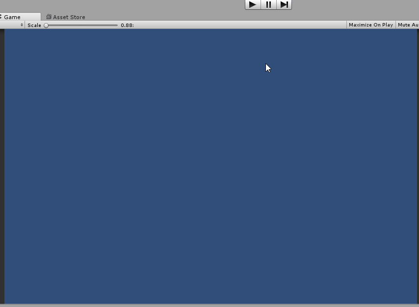
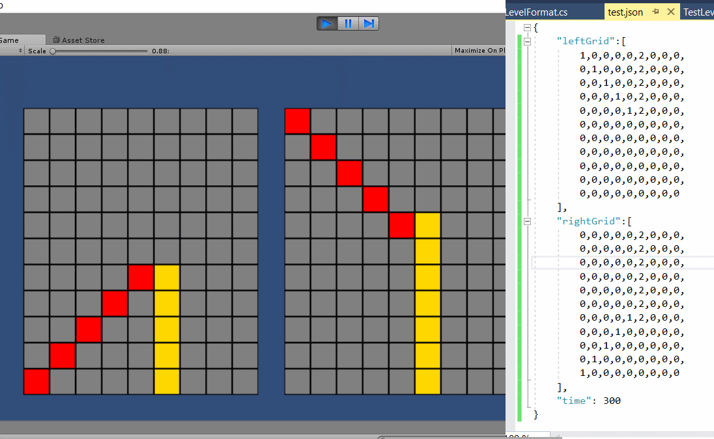
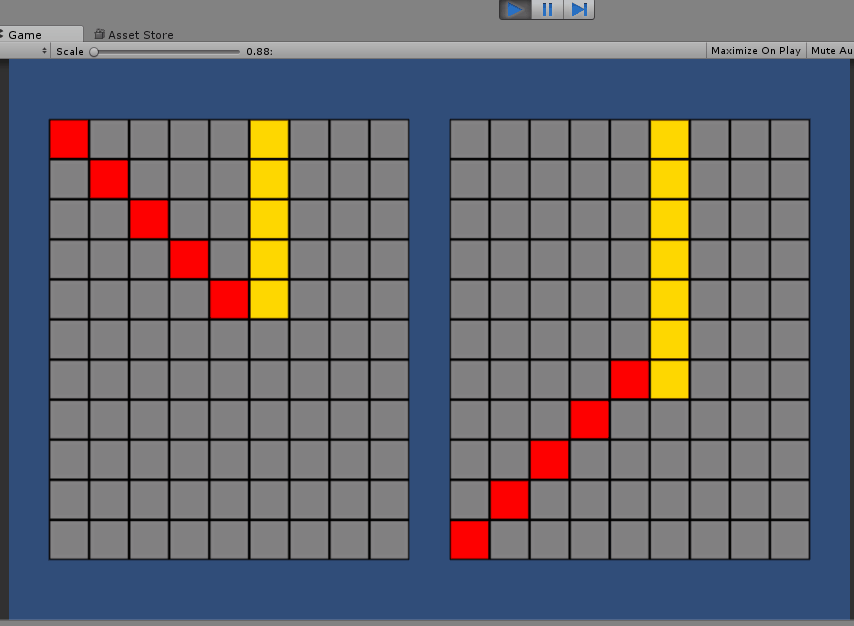
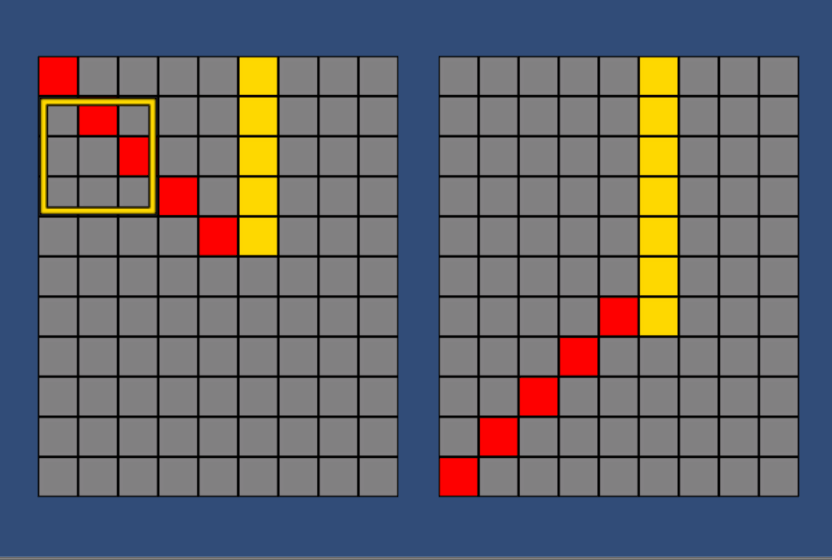
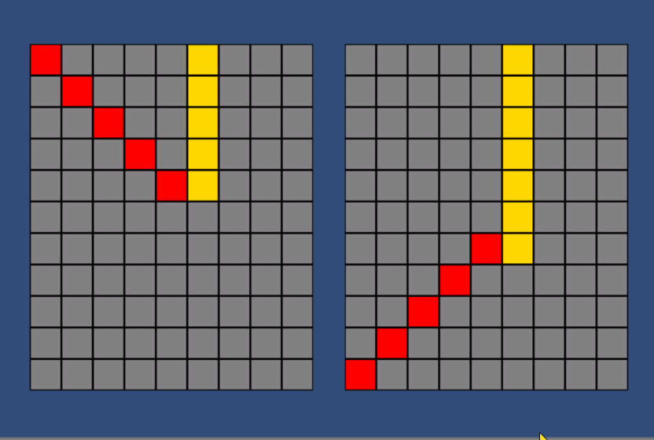
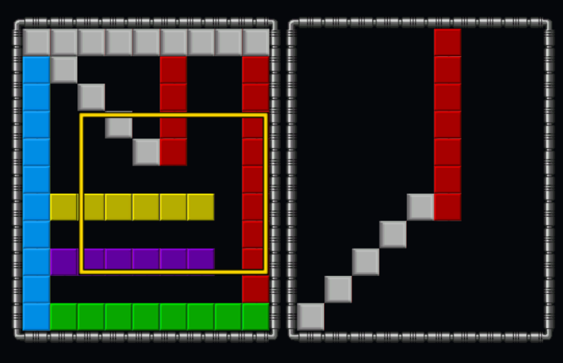
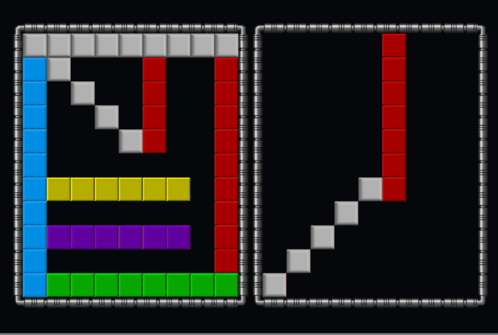

# Rotator Block Dev Log

## 6 June
Basic test code (TestGrid.cs) to check the ability to create 100+ blocks at startup. Its not much to look at, but I needed to be sure if could be done.

 

Its not much to see, a mass of random tiles appearing

(Tech note to self: http://www.screentogif.com/ seems a great tool for animated gif capture, lets have at least one per log)

Tech notes:
* Tile-Sprite set at 32 pixels per unit in Unity makes a tile 1x1
* Camera is size 7 which gives 14*4/3= 18.66 tiles x 14 tiles, which is enough for the 2 grids of 9x11

## 25 June
Looking at tech challenge. How to hold the map?  Simplest idea, use Unity json and test. The code only supports a subset of json (1D array & List only, no dictionary, no 2D arrays), but we can use that. Also managed to load the asset from a .json file stored in the project as a simple TextAsset. Therefore I can use an array or TextAssets for levels, or I can use resource directories.

Also using an idea from http://answers.unity3d.com/questions/40568/base64-encodedecoding.html to use the System's built in base64 encoding to obfuscate data. This is a tech I can drop in later if I need to.

Ran rough test of loading code, almost worked except for the Unity +y is up vs +y is down in arrays.

 

Almost right, reading from json and display on the screen.

Going to take a little more work to get is 100% correct on the screen, but the idea is good.

Next challenge: detecting clicks, and rotating the block about.

## 26 June
Focus for today is the rotating blocks.
Going to ignore the input for now, just work on the switching blocks.

Rather then actually moving the blocks about (which will get messy), instead change the grid of integers around and then update the block sprites to follow this.

Idea looks like a GridModel which holds the grid and a GridView which displays it.  Animation will be on the view, but the actual updating of grid will be on the model (not having a controller).  Inputs can be detected at view level and send out as events.
No actual work done, just a bit of thinking for today.

## 29 June
Installing Zenject and building the main code.
Its always tricky to get started. 
* New Scene
* Add SceneContext object
 * Add MonoInstaller to SceneContext
* Create injectable class (either C# or MonoBehaviour)
 * Add to the MonoInstaller
 * Unless its already in the scene, then add a ZenjectBinding
* Create a user of the injectable
* Test

We can also use a settings installer, which is a scriptable object, but can hold all our settings & even the sprites to use (keeping it apart from the view)
* Create SettingsInstaller class
  * Create a scriptable object instance 
  * Add the scriptable object instance to the SceneContext
* In XxxView.cs
  * Add a System.Serializable Settings struct with all the atts you need
  * [Inject] the Settings into your XxxView
* Add a public XxxView.Settings instance into your SettingsInstaller and add the InstallBindings `Container.BindInstance()` to it
* Find the scriptable object instance and add your settings to it
* Test

Had some issues with having 2 injected grids (left and right), and bigger issues with Zenjects new signal implementation, but managed to overcome.

# 30 June
Managed to fix Zenject issues and got rotation (on a fixed area) working ok.

 

Next stage will be drawing this using the mouse.  Then probably move on to thinking about actual gameplay.

# 7 Aug
Been away from project a long time working on game jams & such like.
Added a new GridFrameView which shows the grid frame (unity has a 9 sliced mode which is great).
Eventually got it working.
 

Now to add the rotation routine.
Added a iSelectionRectangle interface to pass this to the rest of the code. Needed to use a ZenjectBinding to attach this.

 

Next task, proper tweening and adding of gravity.

# 8 Aug
Got an idea on how to do this tweening. Control decides the action, sets a moving flag, informs view to do the tween with a callback fn to control. Once the control gets the callback, it can update the model, fire event to make the view update its data and reset its sprite positions at the same time.

This means that view will need an injectable interface on the view.

Managed that with some issues on the order or injection (if you need something done after injection use Start() )

Next task, solid blocks (which cannot be moved) and empty (which apply gravity).

# 10 Aug

I'm going to start on looking for tilesets rather then work on the solid blocks and gravity. Added some nicer looking tiles and it makes a big difference.

Now lets look into the falling, handled at controller side.

First thing is which do/do not fall? For now just hard code it, but I think that we should set ranges on what does/not fall.

Got the code in, with a rather nice fade to show enabled/not:

But there is a design issue as the code is getting messy with interfaces everywhere. I need to think on this.